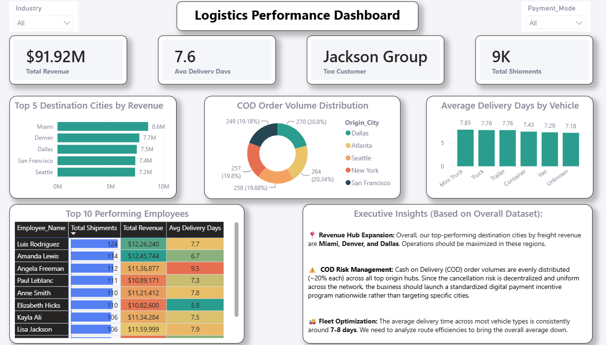

# End-to-End Logistics ETL Pipeline & Executive Analytics

### 💻 Tech Stack Used


## 📌 Project Overview
This project demonstrates an end-to-end data engineering and analytics pipeline designed to optimize enterprise logistics operations. Bridging the gap between raw data engineering and strategic decision-making, raw, uncleaned freight and operational data spanning three separate tables were extracted, programmatically cleaned, and transformed using Python. The refined master dataset was then staged in a cloud data warehouse (Google BigQuery) for targeted SQL analysis, and finally modeled in Power BI to deliver interactive, executive-level business insights.

---

## 🛠️ The Challenge & Business Scenario
An enterprise logistics provider handles thousands of cross-country shipments but faced operational blind spots due to fragmented, dirty data. The business required an automated solution to handle severe data quality issues, enforce database schemas, and answer critical operational questions within a strict performance framework.

### Core Objectives:
1. **Data Quality Framework:** Programmatically resolve structural errors, missing data logic, and invalid numeric values.
2. **Data Warehousing & Optimization:** Stage a unified master dataset in a cloud environment optimized for SQL performance.
3. **Executive Reporting:** Build an optimized reporting solution tracking key operational KPIs, regional revenue, and employee productivity metrics.

---

## 🏗️ System Architecture & Workflow

### 1. Extract & Transform Phase (Python / Pandas)
The ingestion script profiled and cleaned three raw tables: `Logistics Fact`, `Customer Dimension`, and `Employee Dimension`.
* **Data Integrity & Joins:** Validated primary/foreign key mappings to handle orphaned records before executing `Left Joins` to produce a unified master dataset.
* **Text Standardization:** Consolidated disparate categorical entries (e.g., forcing inconsistent strings into uniform `'COD'` and `'PREPAID'` values).
* **Logical Date Correction:** Standardized text strings into proper datetime objects and programmatically mapped `Delivery_Date` to null (`NaT`) for 'Pending' shipments to prevent skewing average transit calculations.
* **Financial Data Cleansing:** Corrected negative freight amounts into absolute positive values to guarantee accurate revenue rollups.

### 2. Load Phase (Google BigQuery)
* **Cloud Warehousing:** Exported the cleansed dataframe into a Google BigQuery cluster.
* **Schema Enforcement:** Configured strict underlying data types (Strings, Floats, Dates) during the write phase to minimize downstream query compilation costs.

### 3. SQL Analysis
Targeted analytical queries were engineered directly inside BigQuery to address key operational milestones:
* Top 5 destination hubs by total freight revenue volume.
* Deep-dive identification of the highest cash-on-delivery (COD) transaction hubs.
* Fleet efficiency routing breakdowns by tracking average delivery duration against vehicle type.
* Core productivity ranking of top-performing account managers.

### 4. Semantic Modeling & DAX (Power BI)
* **Direct Cloud Connectivity:** Connected Power BI directly to the BigQuery analytical layer.
* **Performance Tuning:** Completely bypassed calculated columns inside the visual layer, relying entirely on explicit, lightweight DAX measures to keep the data model hyper-performant:
```dax
  Total Revenue = SUM('Master_Logistics'[Freight_Amount_USD])
  Total Shipments = COUNT('Master_Logistics'[Booking_ID])
  Average Delivery Days = AVERAGE('Master_Logistics'[Delivery_Days])
```
📊 Dashboard & Executive Insights



Key Strategic Takeaways:
High-Level Performance: Total realized revenue reached $91.92M across 9K shipments, averaging a 7.6-day delivery window.

Revenue Hubs: Asset optimization should be prioritized across major destination hubs including Miami ($8.6M), Denver ($7.7M), and Dallas ($7.5M).

COD Risk Mitigation: Cash-on-Delivery (COD) volumes are evenly distributed (~20% each) across origin nodes. Rather than regional targeting, the organization should roll out a standardized digital payment incentive program to minimize localized cash-handling overhead.

Fleet Efficiency Bottlenecks: Average transit time remains static around 7-8 days across all core vehicle classes (Mini Trucks, Trailers, Containers). This strongly implies transit delays are a byproduct of centralized route-planning rather than vehicle capacity limits.


## 📁 Repository Structure
```text
├── Data/                             
│   ├── raw_logistics_data.xlsx         # Initial uncleaned dataset
│   └── cleaned_master_logistics.xlsx   # Transformed dataset ready for BI
├── Scripts/
│   ├── data_cleaning_pipeline.ipynb    # Python Jupyter Notebook for ETL & EDA
│   └── analysis_queries.sql            # Production-ready SQL queries
├── Dashboard/
│   └── Logistics_Performance.pbix      # Power BI Desktop Model
├── Logistic_Power_BI_dashboard.png     # Dashboard preview image
└── README.md                           # Case study documentation
